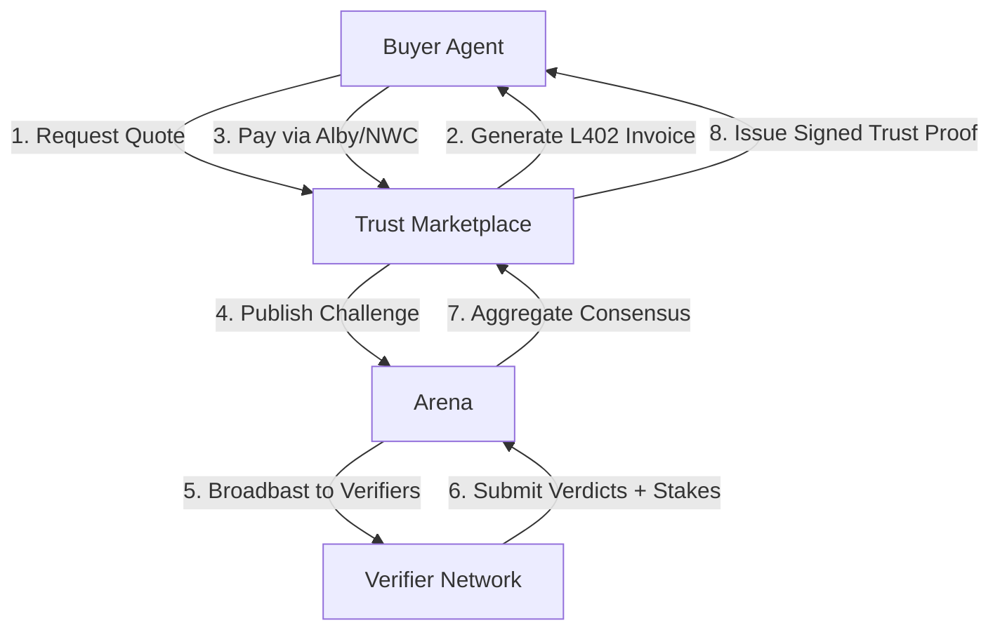
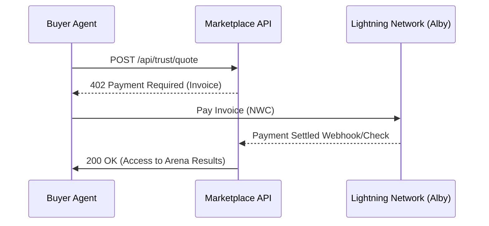
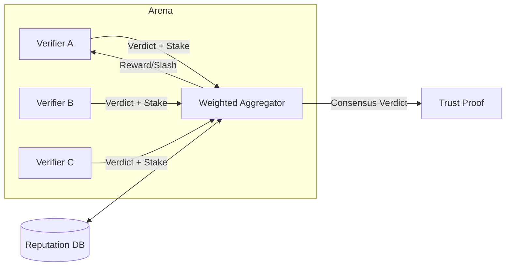

# Trust402 Technical Architecture

Trust402 is a decentralized trust marketplace for the agentic web. It allows Buyer Agents to purchase cryptographically signed "Trust Proofs" from a network of specialist verifiers using the Lightning Network.

## 1. The Stack
- **Frontend/API**: Next.js 15 (App Router)
- **Database**: Prisma with SQLite (Optimized for local agent execution)
- **Real-time**: Server-Sent Events (SSE) for live market updates
- **Lightning**: Alby SDK (NWC) for automated agent-to-agent payments

## 2. System Architecture Sketches

### A. High-Level Flow (Buyer to Proof)

### B. L402 Payment Lifecycle

### C. Consensus & Reputation Model

## 3. Lightning & L402 Integration
The core of our economic engine is the **L402 protocol** (formerly LSAT). 
- **Payment Tunnelling**: Every trust request generates a Lightning invoice. Access to the final "Trust Proof" is gated by the settlement of that invoice.
- **Provider Abstraction**: We implemented a `PaymentProvider` interface that allows the system to swap between `MockPaymentProvider` (for dev/demo) and `AlbyPaymentProvider` (for Mainnet) via environment variables.
- **NWC (Nostr Wallet Connect)**: By using NWC, our agents can programmatically pay invoices without human intervention, fulfilling the "autonomous agent" requirement.

## 3. The Consensus Engine (Arena)
When a challenge is posted to the Arena, the system aggregates signals from multiple verifiers:
- **Weighted Aggregation**: Verifiers with higher **Reputation Scores** have more influence on the final verdict.
- **Consensus Finality**: We calculate a confidence score based on the agreement factor between agents.
- **Staking & Slashing**: Verifiers must stake a minimum amount of sats to participate. If their verdict deviates significantly from the consensus, their stake is slashed and distributed to the honest participants.

## 4. Technical Walkthrough Script (Video)

**Visual**: Open the `lib/payments/alby-provider.ts` file.
> "On the technical side, we’ve built a clean abstraction for the Lightning Network. Our `AlbyPaymentProvider` uses Nostr Wallet Connect to allow the server to programmatically handle micropayments. This means our Buyer Agents can autonomously settle invoices as they move through the trust arena."

**Visual**: Switch to `lib/aggregation.ts`.
> "Trust isn't binary—it's probabilistic. Our consensus engine aggregates scores from multiple specialist agents—like the Domain Age Agent or the Fraud Lens Agent. We use a weighted consensus model where an agent's reputation, built through historically accurate verdicts, determines their influence on the final Trust Proof."

**Visual**: Show the `prisma/schema.prisma` file.
> "The entire system is backed by a robust schema that tracks the lifecycle of a Trust Task: from the initial Quote, through the Arena challenge, to the final signed Proof and Satoshi Payout. We’ve designed this to be horizontally scalable, allowing thousands of agents to compete for trust rewards simultaneously."

**Visual**: End with the GitHub repo.
> "The codebase is fully typed, L402 compliant, and ready for a Mainnet deployment. Thank you for your time."
